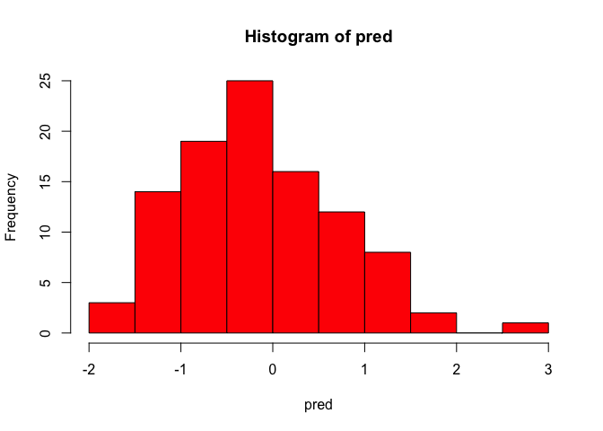
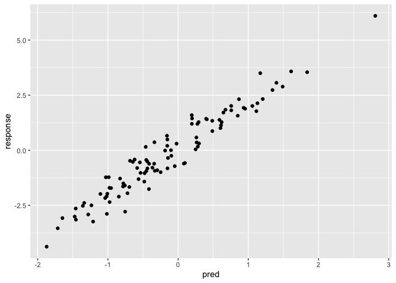
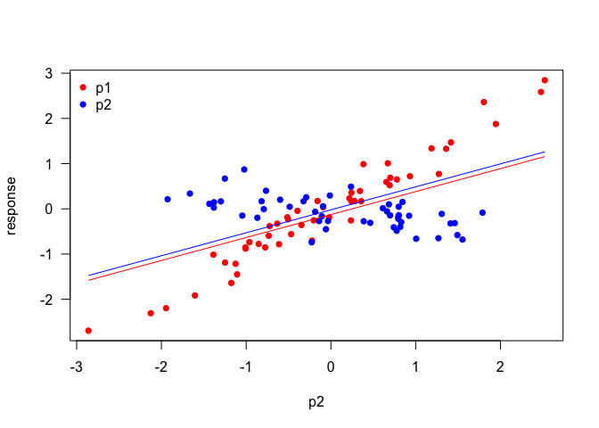

demo\_linearmodel
================
Sara
28/12/2020

``` r
library(tidyverse)
```

    ## ── Attaching packages ─────────────────────────────────────── tidyverse 1.3.0 ──

    ## ✓ ggplot2 3.3.2     ✓ purrr   0.3.4
    ## ✓ tibble  3.0.4     ✓ dplyr   1.0.2
    ## ✓ tidyr   1.1.2     ✓ stringr 1.4.0
    ## ✓ readr   1.4.0     ✓ forcats 0.5.0

    ## ── Conflicts ────────────────────────────────────────── tidyverse_conflicts() ──
    ## x dplyr::filter() masks stats::filter()
    ## x dplyr::lag()    masks stats::lag()

``` r
#simple linear model with one predictor
#simple numeric predictor
num <- 100
pred <- rnorm(100, mean = 0, sd =1)
#rnorm: random generation for the normal distribution
hist(pred, col = 'red')
```

<!-- -->

``` r
#response variable
effect.size <- 2
effect.sd <- 0.5 
response <- rnorm(num, mean = effect.size*pred, sd = effect.sd)
dd <- data.frame(pred= pred, response = response)
head(dd)
```

    ##          pred   response
    ## 1  0.29768093  0.3091896
    ## 2  1.12950953  2.1332335
    ## 3 -0.72103548 -1.9484080
    ## 4  0.08110855 -0.6033301
    ## 5 -0.64469559 -0.5264088
    ## 6  1.60998447  3.5801645

``` r
ggplot(data = dd, aes( x = pred, y = response)) + geom_point()
```

<!-- -->

``` r
out <- lm(response ~ pred, data = dd)
summary(out)
```

    ## 
    ## Call:
    ## lm(formula = response ~ pred, data = dd)
    ## 
    ## Residuals:
    ##      Min       1Q   Median       3Q      Max 
    ## -1.32311 -0.32755 -0.04244  0.29950  1.07900 
    ## 
    ## Coefficients:
    ##             Estimate Std. Error t value Pr(>|t|)    
    ## (Intercept)  0.11058    0.05009   2.207   0.0296 *  
    ## pred         2.08415    0.05655  36.857   <2e-16 ***
    ## ---
    ## Signif. codes:  0 '***' 0.001 '**' 0.01 '*' 0.05 '.' 0.1 ' ' 1
    ## 
    ## Residual standard error: 0.4945 on 98 degrees of freedom
    ## Multiple R-squared:  0.9327, Adjusted R-squared:  0.932 
    ## F-statistic:  1358 on 1 and 98 DF,  p-value: < 2.2e-16

``` r
coeffs <- coef(out)
b0 <- coeffs['(Intercept)']
b1 <- coeffs['pred']
```

``` r
#multiple regression

#first predictor
num.A <- 50
num.B <- 50
p1 <- factor( c (rep('A', num.A), rep('B', num.B)))
p1
```

    ##   [1] A A A A A A A A A A A A A A A A A A A A A A A A A A A A A A A A A A A A A
    ##  [38] A A A A A A A A A A A A A B B B B B B B B B B B B B B B B B B B B B B B B
    ##  [75] B B B B B B B B B B B B B B B B B B B B B B B B B B
    ## Levels: A B

``` r
#rep : replicates the values in x

#second vector
p2 <- rnorm(num.A+num.B, mean = 0, sd = 1)
p2
```

    ##   [1]  1.94599596  1.80434249 -0.09099418 -0.51466588 -2.86124412 -0.63351411
    ##   [7] -0.50587539 -1.38631863 -1.12523128  1.35913779  0.21783127  0.24217896
    ##  [13] -0.72284901 -0.61248312  0.24320967 -1.10695409  0.35649346  0.93203096
    ##  [19] -0.85237374 -0.15772911 -1.00864960  2.52331302  0.65410812  0.67194639
    ##  [25]  2.47839153 -1.17485698  0.77786203 -0.02118516 -0.77526709 -0.20315249
    ##  [31]  0.38382169  0.27775409  1.41620121 -1.24911277 -1.94489283  0.69311946
    ##  [37] -0.46935771 -0.73421624  0.23600965 -1.60452848  1.27336558  0.34282035
    ##  [43] -0.34693600 -0.96205379 -0.22253672  1.18745494 -2.12545574  0.69995543
    ##  [49] -0.39475277 -1.00698304 -0.09258988 -0.05919643  1.26809676 -0.86810805
    ##  [55] -0.32310194 -0.48647466 -0.81827859  0.46390075 -1.38221813 -0.76610686
    ##  [61]  0.80103897 -1.04579548 -1.02300778  0.77571868  0.81822472  0.82944189
    ##  [67] -0.29126318 -0.13903351 -0.18624185  1.46109235 -0.59942434 -1.43459667
    ##  [73]  1.30738054  1.49209278  0.61303404 -1.37939536  1.00553112  0.74142644
    ##  [79] -0.10726001 -1.66355364  0.23658524  0.66148513 -0.79235770 -1.92632033
    ##  [85]  0.79498212  1.41075459  0.84432543 -1.29882202  0.69771501 -0.03424872
    ##  [91]  0.92263182  0.68409338  0.79435950 -1.25125415 -0.22720451  0.38706394
    ##  [97]  1.55246804  0.79947847  1.78844048 -0.01245283

``` r
#response variable
effect.size.A <- 1
effect.size.B <- -0.2

sd.A <- 0.25
sd.B <- 0.25

response <- c(rnorm(num.A, mean = effect.size.A *p2[p1 == 'A'], sd = sd.A), rnorm(num.B, mean = effect.size.B *p2[p1 == 'B'], sd =sd.B))

ff <- data.frame(p1= p1, p2 = p2, response = response)
head(ff)
```

    ##   p1          p2    response
    ## 1  A  1.94599596  1.87687659
    ## 2  A  1.80434249  2.36188292
    ## 3  A -0.09099418  0.03529022
    ## 4  A -0.51466588 -0.18713719
    ## 5  A -2.86124412 -2.69507176
    ## 6  A -0.63351411 -0.32671339

``` r
#colour vector

plot.raw.data <- function() {
  col <- c(rep('red', num.A), rep('blue', num.B))
  plot(x =ff$p2, y= ff$response, xlab ='p2', ylab='response', col=col, pch = 16, las =1)
  legend('topleft',
         bty='n',
         legend= c('p1', 'p2'),
         col= c('red', 'blue'),
         pch=16)
  }
plot.raw.data()

#fit a model without an interaction

out2 <- lm(response ~ p1+p2, data = ff)
summary(out2)
```

    ## 
    ## Call:
    ## lm(formula = response ~ p1 + p2, data = ff)
    ## 
    ## Residuals:
    ##      Min       1Q   Median       3Q      Max 
    ## -1.34053 -0.44959 -0.03327  0.43604  1.58474 
    ## 
    ## Coefficients:
    ##             Estimate Std. Error t value Pr(>|t|)    
    ## (Intercept) -0.02142    0.09901  -0.216    0.829    
    ## p1B         -0.10567    0.14033  -0.753    0.453    
    ## p2           0.50812    0.06675   7.613 1.77e-11 ***
    ## ---
    ## Signif. codes:  0 '***' 0.001 '**' 0.01 '*' 0.05 '.' 0.1 ' ' 1
    ## 
    ## Residual standard error: 0.6991 on 97 degrees of freedom
    ## Multiple R-squared:  0.374,  Adjusted R-squared:  0.3611 
    ## F-statistic: 28.98 on 2 and 97 DF,  p-value: 1.356e-10

``` r
#exttract model ecoeeffcient

coeff <- coef(out2)

b0 <- coeff ['(Intercept)']
b1 <- coeff['p1B'] 
b2 <- coeff['p2']

#lines
plot.raw.data <- function() {
  col <- c(rep('red', num.A), rep('blue', num.B))
  plot(x =ff$p2, y= ff$response, xlab ='p2', ylab='response', col=col, pch = 16, las =1)
  legend('topleft',
         bty='n',
         legend= c('p1', 'p2'),
         col= c('red', 'blue'),
         pch=16)
  curve(b0 + b1*0 + b2*x, from = min(ff$p2), 
        to = max(ff$p2), 
        add = TRUE, 
        col = 'blue')
  curve(b0 + b1*1 + b2*x, 
        from = min(ff$p2), 
        to =max(ff$p2), 
        add = TRUE, col= 'red')
  }
plot.raw.data()
```

<!-- -->

``` r
#mode with an interaction
out <- lm ( response ~ p2*p1, data = ff)
coeff <- coef(out)
```
