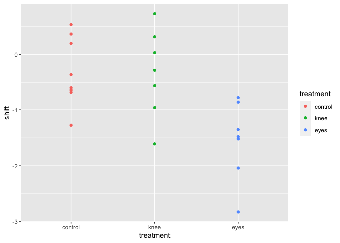
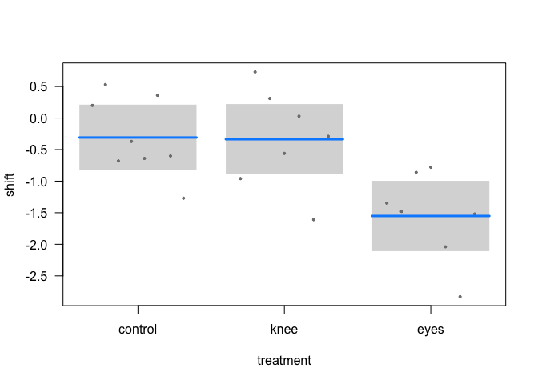

Linea\_model
================

``` r
#1
lions <- read.csv('lions.csv')
#2
head(lions)
```

    ##   age black
    ## 1 1.1  0.21
    ## 2 1.5  0.14
    ## 3 1.9  0.11
    ## 4 2.2  0.13
    ## 5 2.6  0.12
    ## 6 3.2  0.13

``` r
#3 
#response variable: age, explanatory variable: black dots
b <- ggplot( data = lions, aes(x = black, y = age))+ geom_point()
b
```

<!-- -->

``` r
#fit a linear model
out <- lm(age ~ black, data = lions)
slo <- coef(summary(out))['black', 'Estimate']
int <- coef(summary(out))['(Intercept)','Estimate']
b <- ggplot( data = lions, aes(x = black, y = age))+ geom_point() + geom_abline(aes(intercept = int, slope = slo, color = 'blue'))
b
```

<!-- -->

``` r
#4
confint(out, level = 0.95)
```

    ##                  2.5 %    97.5 %
    ## (Intercept) -0.2826733  2.040686
    ## black        7.5643082 13.729931

``` r
#5
drop1(out, test = 'F')
```

    ## Single term deletions
    ## 
    ## Model:
    ## age ~ black
    ##        Df Sum of Sq     RSS    AIC F value    Pr(>F)    
    ## <none>               83.543 34.708                      
    ## black   1    138.54 222.087 63.995  49.751 7.677e-08 ***
    ## ---
    ## Signif. codes:  0 '***' 0.001 '**' 0.01 '*' 0.05 '.' 0.1 ' ' 1

``` r
anova(out)
```

    ## Analysis of Variance Table
    ## 
    ## Response: age
    ##           Df  Sum Sq Mean Sq F value    Pr(>F)    
    ## black      1 138.544 138.544  49.751 7.677e-08 ***
    ## Residuals 30  83.543   2.785                      
    ## ---
    ## Signif. codes:  0 '***' 0.001 '**' 0.01 '*' 0.05 '.' 0.1 ' ' 1

``` r
#6
plot(out)
```

<!-- --><!-- --><!-- --><!-- -->

``` r
#7
lionssans <- lions %>% subset(age<13.1)
out2 <- lm(age ~ black, data = lionssans)
summary(out2)
```

    ## 
    ## Call:
    ## lm(formula = age ~ black, data = lionssans)
    ## 
    ## Residuals:
    ##     Min      1Q  Median      3Q     Max 
    ## -2.0522 -0.9810 -0.4072  0.6353  3.4973 
    ## 
    ## Coefficients:
    ##             Estimate Std. Error t value Pr(>|t|)    
    ## (Intercept)   1.2938     0.5089   2.542   0.0166 *  
    ## black         8.8498     1.4175   6.243 8.19e-07 ***
    ## ---
    ## Signif. codes:  0 '***' 0.001 '**' 0.01 '*' 0.05 '.' 0.1 ' ' 1
    ## 
    ## Residual standard error: 1.447 on 29 degrees of freedom
    ## Multiple R-squared:  0.5734, Adjusted R-squared:  0.5587 
    ## F-statistic: 38.98 on 1 and 29 DF,  p-value: 8.191e-07

``` r
#Prediction

b
```

<!-- -->

``` r
# 2
new.vals <- data.frame(black=seq(min(lions$black),max(lions$black), length=20))
conf_int <- predict(out, newdata = new.vals, interval = "confidence")

#in base... 
plot(x=lions$black, y=lions$age, xlab='Amount of black in nose', ylab='Age', pch=16, col='red', las=1) + abline(out, lwd=2, col='blue') + lines(x=new.vals[,'black'], y=conf_int[,'lwr'], lwd=2, lty=3, col='blue') + lines( x = new.vals[,'black'], y = conf_int[, 'upr'], lwd =2, lty =2, col ='blue')
```

<!-- -->

    ## integer(0)

``` r
#inggplot....
ggplot( data = lions, aes(x = black, y = age))+ geom_point() + geom_abline(aes(intercept = int, slope = slo, color = 'blue')) + geom_smooth(method=lm , color="red", fill="#69b3a2", se=TRUE)
```

    ## `geom_smooth()` using formula 'y ~ x'

<!-- -->

``` r
#4
pred <- predict(out, newdata = new.vals, interval = "prediction") 
plot(x=lions$black, y=lions$age, xlab='Amount of black in nose', ylab='Age', pch=16, col='red', las=1) + abline(out, lwd=2, col='blue') + lines(x=new.vals[,'black'], y=conf_int[,'lwr'], lwd=2, lty=3, col='blue') + lines( x = new.vals[,'black'], y = conf_int[, 'upr'], lwd =2, lty =2, col ='blue') + lines( x = new.vals[,'black'], y = pred[, 'upr'], lwd =2, lty =2, col ='green') + lines( x = new.vals[,'black'], y = pred[, 'lwr'], lwd =2, lty =2, col ='green')
```

<!-- -->

    ## integer(0)

``` r
#effects of light treatment on circadian rhythms
#1
knee <- read_csv('knees.csv')
```

    ## 
    ## ── Column specification ────────────────────────────────────────────────────────
    ## cols(
    ##   treatment = col_character(),
    ##   shift = col_double()
    ## )

``` r
#2
head(knee)
```

    ## # A tibble: 6 x 2
    ##   treatment shift
    ##   <chr>     <dbl>
    ## 1 control    0.2 
    ## 2 control    0.53
    ## 3 control   -0.68
    ## 4 control   -0.37
    ## 5 control   -0.64
    ## 6 control    0.36

``` r
#3
summary(knee)
```

    ##   treatment             shift        
    ##  Length:22          Min.   :-2.8300  
    ##  Class :character   1st Qu.:-1.3300  
    ##  Mode  :character   Median :-0.6600  
    ##                     Mean   :-0.7127  
    ##                     3rd Qu.:-0.0500  
    ##                     Max.   : 0.7300

``` r
#treatment variable is a character 
knee$treatment <- as.factor(knee$treatment)
class(knee$treatment)
```

    ## [1] "factor"

``` r
#5
knee$treatment <- knee$treatment %>% fct_relevel("control", "knee", "eyes")
knee$treatment %>% head()
```

    ## [1] control control control control control control
    ## Levels: control knee eyes

``` r
#6
c <- ggplot( data = knee, aes( x = treatment, y = shift)) + geom_point(aes(color = treatment))
c
```

<!-- -->

``` r
#fit a linear model 

#1
circa <- lm(shift ~ treatment, data = knee)
summ_circa <- summary(circa)

#2
visreg(circa, xvar= 'treatment')
```

<!-- -->

``` r
#4
model.matrix(circa)
```

    ##    (Intercept) treatmentknee treatmenteyes
    ## 1            1             0             0
    ## 2            1             0             0
    ## 3            1             0             0
    ## 4            1             0             0
    ## 5            1             0             0
    ## 6            1             0             0
    ## 7            1             0             0
    ## 8            1             0             0
    ## 9            1             1             0
    ## 10           1             1             0
    ## 11           1             1             0
    ## 12           1             1             0
    ## 13           1             1             0
    ## 14           1             1             0
    ## 15           1             1             0
    ## 16           1             0             1
    ## 17           1             0             1
    ## 18           1             0             1
    ## 19           1             0             1
    ## 20           1             0             1
    ## 21           1             0             1
    ## 22           1             0             1
    ## attr(,"assign")
    ## [1] 0 1 1
    ## attr(,"contrasts")
    ## attr(,"contrasts")$treatment
    ## [1] "contr.treatment"

``` r
#5
summ_circa
```

    ## 
    ## Call:
    ## lm(formula = shift ~ treatment, data = knee)
    ## 
    ## Residuals:
    ##      Min       1Q   Median       3Q      Max 
    ## -1.27857 -0.36125  0.03857  0.61147  1.06571 
    ## 
    ## Coefficients:
    ##               Estimate Std. Error t value Pr(>|t|)   
    ## (Intercept)   -0.30875    0.24888  -1.241  0.22988   
    ## treatmentknee -0.02696    0.36433  -0.074  0.94178   
    ## treatmenteyes -1.24268    0.36433  -3.411  0.00293 **
    ## ---
    ## Signif. codes:  0 '***' 0.001 '**' 0.01 '*' 0.05 '.' 0.1 ' ' 1
    ## 
    ## Residual standard error: 0.7039 on 19 degrees of freedom
    ## Multiple R-squared:  0.4342, Adjusted R-squared:  0.3746 
    ## F-statistic: 7.289 on 2 and 19 DF,  p-value: 0.004472

``` r
#6
emmeans(circa, specs = 'treatment')
```

    ##  treatment emmean    SE df lower.CL upper.CL
    ##  control   -0.309 0.249 19   -0.830    0.212
    ##  knee      -0.336 0.266 19   -0.893    0.221
    ##  eyes      -1.551 0.266 19   -2.108   -0.995
    ## 
    ## Confidence level used: 0.95

``` r
knee %>% group_by(treatment) %>% summarise(mean(shift))
```

    ## `summarise()` ungrouping output (override with `.groups` argument)

    ## # A tibble: 3 x 2
    ##   treatment `mean(shift)`
    ##   <fct>             <dbl>
    ## 1 control          -0.309
    ## 2 knee             -0.336
    ## 3 eyes             -1.55

``` r
#7
drop1(circa, test = 'F')
```

    ## Single term deletions
    ## 
    ## Model:
    ## shift ~ treatment
    ##           Df Sum of Sq     RSS      AIC F value   Pr(>F)   
    ## <none>                  9.4153 -12.6714                    
    ## treatment  2    7.2245 16.6398  -4.1433  7.2894 0.004472 **
    ## ---
    ## Signif. codes:  0 '***' 0.001 '**' 0.01 '*' 0.05 '.' 0.1 ' ' 1

``` r
#
```
