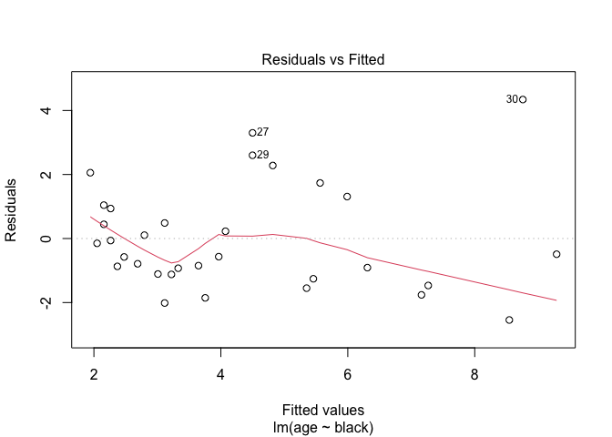

Linea\_model
================

``` r
#1
lions <- read.csv('lions.csv')
#2
head(lions)
```

    ##   age black
    ## 1 1.1  0.21
    ## 2 1.5  0.14
    ## 3 1.9  0.11
    ## 4 2.2  0.13
    ## 5 2.6  0.12
    ## 6 3.2  0.13

``` r
#3 
#response variable: age, explanatory variable: black dots
b <- ggplot( data = lions, aes(x = black, y = age))+ geom_point()
b
```

<!-- -->

``` r
#fit a linear model
out <- lm(age ~ black, data = lions)
slo <- coef(summary(out))['black', 'Estimate']
int <- coef(summary(out))['(Intercept)','Estimate']
b <- ggplot( data = lions, aes(x = black, y = age))+ geom_point() + geom_abline(aes(intercept = int, slope = slo, color = 'blue'))
b
```

<!-- -->

``` r
#4
confint(out, level = 0.95)
```

    ##                  2.5 %    97.5 %
    ## (Intercept) -0.2826733  2.040686
    ## black        7.5643082 13.729931

``` r
#5
drop1(out, test = 'F')
```

    ## Single term deletions
    ## 
    ## Model:
    ## age ~ black
    ##        Df Sum of Sq     RSS    AIC F value    Pr(>F)    
    ## <none>               83.543 34.708                      
    ## black   1    138.54 222.087 63.995  49.751 7.677e-08 ***
    ## ---
    ## Signif. codes:  0 '***' 0.001 '**' 0.01 '*' 0.05 '.' 0.1 ' ' 1

``` r
anova(out)
```

    ## Analysis of Variance Table
    ## 
    ## Response: age
    ##           Df  Sum Sq Mean Sq F value    Pr(>F)    
    ## black      1 138.544 138.544  49.751 7.677e-08 ***
    ## Residuals 30  83.543   2.785                      
    ## ---
    ## Signif. codes:  0 '***' 0.001 '**' 0.01 '*' 0.05 '.' 0.1 ' ' 1

``` r
#6
plot(out)
```

<!-- --><!-- --><!-- --><!-- -->

``` r
#7
lionssans <- lions %>% subset(age<13.1)
out2 <- lm(age ~ black, data = lionssans)
summary(out2)
```

    ## 
    ## Call:
    ## lm(formula = age ~ black, data = lionssans)
    ## 
    ## Residuals:
    ##     Min      1Q  Median      3Q     Max 
    ## -2.0522 -0.9810 -0.4072  0.6353  3.4973 
    ## 
    ## Coefficients:
    ##             Estimate Std. Error t value Pr(>|t|)    
    ## (Intercept)   1.2938     0.5089   2.542   0.0166 *  
    ## black         8.8498     1.4175   6.243 8.19e-07 ***
    ## ---
    ## Signif. codes:  0 '***' 0.001 '**' 0.01 '*' 0.05 '.' 0.1 ' ' 1
    ## 
    ## Residual standard error: 1.447 on 29 degrees of freedom
    ## Multiple R-squared:  0.5734, Adjusted R-squared:  0.5587 
    ## F-statistic: 38.98 on 1 and 29 DF,  p-value: 8.191e-07

``` r
#Prediction

b
```

<!-- -->

``` r
# 2
new.vals <- data.frame(black=seq(min(lions$black),max(lions$black), length=20))
conf_int <- predict(out, newdata = new.vals, interval = "confidence")

#in base... 
plot(x=lions$black, y=lions$age, xlab='Amount of black in nose', ylab='Age', pch=16, col='red', las=1) + abline(out, lwd=2, col='blue') + lines(x=new.vals[,'black'], y=conf_int[,'lwr'], lwd=2, lty=3, col='blue') + lines( x = new.vals[,'black'], y = conf_int[, 'upr'], lwd =2, lty =2, col ='blue')
```

<!-- -->

    ## integer(0)

``` r
#inggplot....
ggplot( data = lions, aes(x = black, y = age))+ geom_point() + geom_abline(aes(intercept = int, slope = slo, color = 'blue')) + geom_smooth(method=lm , color="red", fill="#69b3a2", se=TRUE)
```

    ## `geom_smooth()` using formula 'y ~ x'

<!-- -->

``` r
#4
pred <- predict(out, newdata = new.vals, interval = "prediction") 
plot(x=lions$black, y=lions$age, xlab='Amount of black in nose', ylab='Age', pch=16, col='red', las=1) + abline(out, lwd=2, col='blue') + lines(x=new.vals[,'black'], y=conf_int[,'lwr'], lwd=2, lty=3, col='blue') + lines( x = new.vals[,'black'], y = conf_int[, 'upr'], lwd =2, lty =2, col ='blue') + lines( x = new.vals[,'black'], y = pred[, 'upr'], lwd =2, lty =2, col ='green') + lines( x = new.vals[,'black'], y = pred[, 'lwr'], lwd =2, lty =2, col ='green')
```

<!-- -->

    ## integer(0)

``` r
#effects of light treatment on circadian rhythms
```
