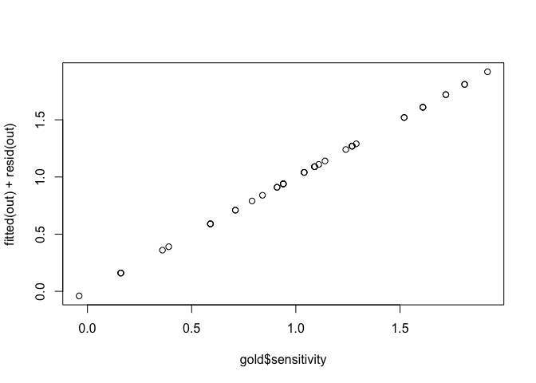
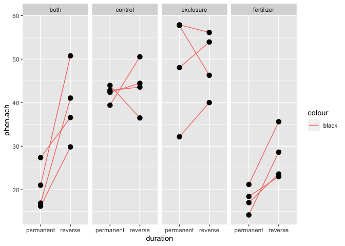

mixed\_effect
================
Sara

``` r
flycatcher <- read.csv('flycatcher.csv')
head(flycatcher) 
```

    ##   bird patch year
    ## 1    1  10.5 1998
    ## 2    2  10.6 1998
    ## 3    3   8.7 1998
    ## 4    4   8.6 1998
    ## 5    5   9.0 1998
    ## 6    6   9.3 1998

``` r
ggplot(data = flycatcher, aes( x = year, y = patch, group = year)) + geom_boxplot()
```

<!-- -->

``` r
#1
class(flycatcher$year)
```

    ## [1] "integer"

``` r
flycatcher$year <- as.factor(flycatcher$year)
class(flycatcher$year)
```

    ## [1] "factor"

``` r
#indivudal birds as the random groups
out <- lmer(patch ~ 1 + (1|bird), data = flycatcher)
summ <- summary(out)
summ
```

    ## Linear mixed model fit by REML ['lmerMod']
    ## Formula: patch ~ 1 + (1 | bird)
    ##    Data: flycatcher
    ## 
    ## REML criterion at convergence: 171
    ## 
    ## Scaled residuals: 
    ##      Min       1Q   Median       3Q      Max 
    ## -1.62368 -0.58351  0.03328  0.51009  1.67263 
    ## 
    ## Random effects:
    ##  Groups   Name        Variance Std.Dev.
    ##  bird     (Intercept) 1.243    1.1150  
    ##  Residual             0.358    0.5983  
    ## Number of obs: 60, groups:  bird, 30
    ## 
    ## Fixed effects:
    ##             Estimate Std. Error t value
    ## (Intercept)   7.5100     0.2177   34.49

``` r
outwith <- lmer(patch ~ 1 +(1|bird) + (1|year), data =flycatcher)
outwith
```

    ## Linear mixed model fit by REML ['lmerMod']
    ## Formula: patch ~ 1 + (1 | bird) + (1 | year)
    ##    Data: flycatcher
    ## REML criterion at convergence: 170.6204
    ## Random effects:
    ##  Groups   Name        Std.Dev.
    ##  bird     (Intercept) 1.1182  
    ##  year     (Intercept) 0.1193  
    ##  Residual             0.5863  
    ## Number of obs: 60, groups:  bird, 30; year, 2
    ## Fixed Effects:
    ## (Intercept)  
    ##        7.51

``` r
#4
VarCorr(out)
```

    ##  Groups   Name        Std.Dev.
    ##  bird     (Intercept) 1.11504 
    ##  Residual             0.59833

``` r
#6
plot( x = fitted(out), y = resid(out), pch = 16)
```

<!-- -->

``` r
gold <- read.csv('goldfish.csv')
head(gold)
```

    ##    fish wavelength sensitivity
    ## 1 fish1      nm426        0.94
    ## 2 fish2      nm426        0.94
    ## 3 fish3      nm426        0.94
    ## 4 fish4      nm426        1.14
    ## 5 fish5      nm426        0.94
    ## 6 fish1      nm462        1.09

``` r
interaction.plot(response=gold$sensitivity,
                 x.factor = gold$wavelength,
                 trace.factor = gold$fish,
                 legend = FALSE,
                 lty = 1,
                 xlab = 'Wavelength', ylab = 'Sensitivity', type = 'b', pch =16, las =1)
```

<!-- -->

``` r
#ggplot

ggplot(data = gold, aes( x = wavelength, y = sensitivity, group = fish))+ geom_point() + geom_line() + theme_classic()
```

<!-- -->

``` r
#3 : subject by treatment, repeated measures design, since each fish is measured once under each treatment 


#fit a linear mixed effect models
#1
out <- lmer(sensitivity ~ wavelength + (1|fish), data = gold)
```

    ## boundary (singular) fit: see ?isSingular

``` r
summ <- summary(out)
summ
```

    ## Linear mixed model fit by REML ['lmerMod']
    ## Formula: sensitivity ~ wavelength + (1 | fish)
    ##    Data: gold
    ## 
    ## REML criterion at convergence: -32.2
    ## 
    ## Scaled residuals: 
    ##     Min      1Q  Median      3Q     Max 
    ## -1.5811 -0.3162  0.0000  0.3162  1.8974 
    ## 
    ## Random effects:
    ##  Groups   Name        Variance Std.Dev.
    ##  fish     (Intercept) 0.000    0.0000  
    ##  Residual             0.016    0.1265  
    ## Number of obs: 45, groups:  fish, 5
    ## 
    ## Fixed effects:
    ##                 Estimate Std. Error t value
    ## (Intercept)      0.98000    0.05657  17.324
    ## wavelengthnm462  0.15000    0.08000   1.875
    ## wavelengthnm494 -0.11000    0.08000  -1.375
    ## wavelengthnm528  0.06000    0.08000   0.750
    ## wavelengthnm585  0.29000    0.08000   3.625
    ## wavelengthnm615  0.71000    0.08000   8.875
    ## wavelengthnm634  0.70000    0.08000   8.750
    ## wavelengthnm670 -0.39000    0.08000  -4.875
    ## wavelengthnm700 -0.82000    0.08000 -10.250
    ## 
    ## Correlation of Fixed Effects:
    ##             (Intr) wvl462 wvl494 wvl528 wvl585 wvl615 wvl634 wvl670
    ## wvlngthn462 -0.707                                                 
    ## wvlngthn494 -0.707  0.500                                          
    ## wvlngthn528 -0.707  0.500  0.500                                   
    ## wvlngthn585 -0.707  0.500  0.500  0.500                            
    ## wvlngthn615 -0.707  0.500  0.500  0.500  0.500                     
    ## wvlngthn634 -0.707  0.500  0.500  0.500  0.500  0.500              
    ## wvlngthn670 -0.707  0.500  0.500  0.500  0.500  0.500  0.500       
    ## wvlngthn700 -0.707  0.500  0.500  0.500  0.500  0.500  0.500  0.500
    ## optimizer (nloptwrap) convergence code: 0 (OK)
    ## boundary (singular) fit: see ?isSingular

``` r
#2
visreg(out, xvar = 'wavelength')
```

    ## boundary (singular) fit: see ?isSingular

<!-- -->

``` r
#3
fitted(out) + resid(out)
```

    ##     1     2     3     4     5     6     7     8     9    10    11    12    13 
    ##  0.94  0.94  0.94  1.14  0.94  1.09  1.09  1.09  1.29  1.09  0.71  0.71  0.91 
    ##    14    15    16    17    18    19    20    21    22    23    24    25    26 
    ##  0.91  1.11  0.84  1.04  1.04  1.04  1.24  1.27  1.27  1.27  1.27  1.27  1.81 
    ##    27    28    29    30    31    32    33    34    35    36    37    38    39 
    ##  1.81  1.61  1.61  1.61  1.92  1.72  1.72  1.52  1.52  0.59  0.79  0.59  0.59 
    ##    40    41    42    43    44    45 
    ##  0.39  0.16  0.36  0.16  0.16 -0.04

``` r
gold$sensitivity
```

    ##  [1]  0.94  0.94  0.94  1.14  0.94  1.09  1.09  1.09  1.29  1.09  0.71  0.71
    ## [13]  0.91  0.91  1.11  0.84  1.04  1.04  1.04  1.24  1.27  1.27  1.27  1.27
    ## [25]  1.27  1.81  1.81  1.61  1.61  1.61  1.92  1.72  1.72  1.52  1.52  0.59
    ## [37]  0.79  0.59  0.59  0.39  0.16  0.36  0.16  0.16 -0.04

``` r
plot( x = gold$sensitivity, y = fitted(out) + resid(out))
```

<!-- -->

``` r
#4
plot( y = resid(out), x = fitted(out)) + abline(a=0, b=0, lty=2, col='red')
```

<!-- -->

    ## integer(0)

``` r
#1
kk <- read.csv('kluane.csv')

#3 split -plot design, plots assign randomlytreatments

#4
ggplot(data = kk, aes( x = duration, y = phen.ach)) + facet_grid(cols = vars(treatment)) + geom_line(aes(group = plot, color = "black")) + geom_point(size = 3)
```

<!-- -->

``` r
#fit a linear mixed effect model 
#1
out <- lmer(log(phen.ach) ~ treatment + duration + (1|plot), data = kk) 
```

    ## boundary (singular) fit: see ?isSingular

``` r
summ <- summary (out)
summ
```

    ## Linear mixed model fit by REML ['lmerMod']
    ## Formula: log(phen.ach) ~ treatment + duration + (1 | plot)
    ##    Data: kk
    ## 
    ## REML criterion at convergence: 8.9
    ## 
    ## Scaled residuals: 
    ##      Min       1Q   Median       3Q      Max 
    ## -1.67446 -0.54663 -0.03662  0.58315  1.93577 
    ## 
    ## Random effects:
    ##  Groups   Name        Variance Std.Dev.
    ##  plot     (Intercept) 0.00000  0.0000  
    ##  Residual             0.05543  0.2354  
    ## Number of obs: 32, groups:  plot, 16
    ## 
    ## Fixed effects:
    ##                     Estimate Std. Error t value
    ## (Intercept)          3.18108    0.09306  34.182
    ## treatmentcontrol     0.43013    0.11771   3.654
    ## treatmentexclosure   0.54840    0.11771   4.659
    ## treatmentfertilizer -0.24032    0.11771  -2.042
    ## durationreverse      0.29009    0.08324   3.485
    ## 
    ## Correlation of Fixed Effects:
    ##             (Intr) trtmntc trtmntx trtmntf
    ## trtmntcntrl -0.632                        
    ## trtmntxclsr -0.632  0.500                 
    ## trtmntfrtlz -0.632  0.500   0.500         
    ## duratinrvrs -0.447  0.000   0.000   0.000 
    ## optimizer (nloptwrap) convergence code: 0 (OK)
    ## boundary (singular) fit: see ?isSingular

``` r
# visualize 
#plot residuals 

plot( x = fitted(out), y = resid(out)) + abline( h = 0, col = 'red')
```

<!-- -->

    ## integer(0)

``` r
#qq-plot (check normlity)
qqnorm(as.vector(resid(out)))
```

<!-- -->

``` r
#2
out <- lmer(log(phen.ach) ~ treatment * duration + ( 1|plot), data = kk)
summ <- summary(out)
summ
```

    ## Linear mixed model fit by REML ['lmerMod']
    ## Formula: log(phen.ach) ~ treatment * duration + (1 | plot)
    ##    Data: kk
    ## 
    ## REML criterion at convergence: -1.4
    ## 
    ## Scaled residuals: 
    ##      Min       1Q   Median       3Q      Max 
    ## -1.55278 -0.58471  0.03425  0.52871  1.61347 
    ## 
    ## Random effects:
    ##  Groups   Name        Variance Std.Dev.
    ##  plot     (Intercept) 0.01292  0.1137  
    ##  Residual             0.02413  0.1553  
    ## Number of obs: 32, groups:  plot, 16
    ## 
    ## Fixed effects:
    ##                                     Estimate Std. Error t value
    ## (Intercept)                          2.99299    0.09624  31.100
    ## treatmentcontrol                     0.74732    0.13610   5.491
    ## treatmentexclosure                   0.87120    0.13610   6.401
    ## treatmentfertilizer                 -0.12795    0.13610  -0.940
    ## durationreverse                      0.66627    0.10984   6.066
    ## treatmentcontrol:durationreverse    -0.63438    0.15534  -4.084
    ## treatmentexclosure:durationreverse  -0.64559    0.15534  -4.156
    ## treatmentfertilizer:durationreverse -0.22474    0.15534  -1.447
    ## 
    ## Correlation of Fixed Effects:
    ##             (Intr) trtmntc trtmntx trtmntf drtnrv trtmntc: trtmntx:
    ## trtmntcntrl -0.707                                                 
    ## trtmntxclsr -0.707  0.500                                          
    ## trtmntfrtlz -0.707  0.500   0.500                                  
    ## duratinrvrs -0.571  0.404   0.404   0.404                          
    ## trtmntcntr:  0.404 -0.571  -0.285  -0.285  -0.707                  
    ## trtmntxcls:  0.404 -0.285  -0.571  -0.285  -0.707  0.500           
    ## trtmntfrtl:  0.404 -0.285  -0.285  -0.571  -0.707  0.500    0.500

``` r
visreg(out, xvar ='duration', by = 'treatment')
```

<!-- -->

``` r
#3
plot( y =resid(out), x = fitted(out))
```

<!-- -->
